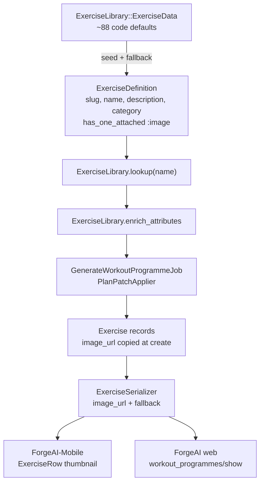
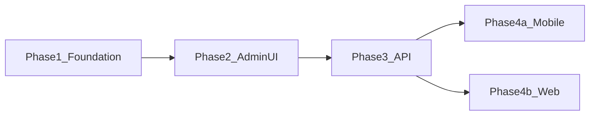

# Exercise Catalog & Image Management

**Location:** `.cursor/plans/exercise_catalog.plan.md`

---

## 1. Problem statement

Exercise metadata today lives in a hardcoded Ruby hash ([ForgeAI/app/services/exercise_library/exercise_data.rb](../ForgeAI/app/services/exercise_library/exercise_data.rb), ~88 exercises). There is no admin UI, no images, and no way to update content without a deploy.

Videos are scaffolded (`video_url` on `exercises` and in the library) but **never used** — no video files exist, nothing is rendered in web or mobile, and [ForgeAI/app/serializers/exercise_serializer.rb](../ForgeAI/app/serializers/exercise_serializer.rb) does not expose `video_url`. **This feature covers still images only.**

Users currently see exercise names, sets/reps, and text descriptions (web only). Goal: a managed catalog admins can maintain, with images flowing into programmes and client apps.

---

## 2. Goals and non-goals

### Goals
- Canonical exercise catalog in the database, seeded from existing library
- Admin UI to browse exercises, edit metadata, upload images
- `ExerciseLibrary.lookup` resolves DB first, code defaults as fallback
- Programme generation and API expose `image_url` to clients
- Optional: show images in mobile and web programme views

### Non-goals (v1)
- Video upload or playback
- User-facing exercise CRUD (admin only)
- Fully replacing the hardcoded library (hybrid: code defaults + DB overrides)
- AI-generated exercise images
- Backfilling images onto every historical `Exercise` row (use read-time fallback instead)

---

## 3. Architecture



### Key decisions
- **Images on the catalog, not per-programme rows.** `Exercise` belongs to `WorkoutDay` (one row per user per programme). Upload once on `ExerciseDefinition`; copy `image_url` onto `Exercise` at creation time.
- **Slug as stable key:** `name.parameterize` (e.g. `"Barbell Bench Press"` → `"barbell-bench-press"`).
- **One plan, phased delivery:** ForgeAI owns data + admin + API; ForgeAI-Mobile and web are read-only consumers after Phase 3.

---

## 4. Data model

### New table: `exercise_definitions`

| Column | Type | Notes |
|--------|------|-------|
| `slug` | string | NOT NULL, unique index |
| `name` | string | NOT NULL, display name |
| `description` | text | nullable; blank = use code default |
| `category` | string | nullable; blank = use code default |
| timestamps | | |

Active Storage: `has_one_attached :image` (mirror [ForgeAI/app/models/coach_profile.rb](../ForgeAI/app/models/coach_profile.rb) validation: PNG/JPEG/WebP, max 5MB).

### Existing table: `exercises`

| Column | Change |
|--------|--------|
| `image_url` | **Add** string, nullable |
| `video_url` | Leave as-is; unused, cleanup in later PR |

### Model: `ExerciseDefinition`

- `validates :slug, :name` presence; slug uniqueness
- `validates :category, inclusion: { in: Exercise::CATEGORIES }, allow_nil: true`
- `#to_library_entry` merges DB fields with code defaults via new `ExerciseLibrary.code_lookup`
- `#image_url` returns `rails_blob_url` when attached

---

## 5. Service layer

### Refactor [ForgeAI/app/services/exercise_library.rb](../ForgeAI/app/services/exercise_library.rb)

```ruby
def self.lookup(exercise_name)
  db = ExerciseDefinition.find_by(slug: exercise_name.parameterize)
  return db.to_library_entry if db
  code_lookup(exercise_name)
end
```

Add `code_lookup`, `enrich_attributes`, `image_url_for`, `all_names`.

### Central enrichment (fixes current inconsistency)

Today library fields are applied inconsistently:
- [ForgeAI/app/services/fallback_programme_generator.rb](../ForgeAI/app/services/fallback_programme_generator.rb) — `enrich_with_library` adds description/category/video_url
- [ForgeAI/app/jobs/generate_workout_programme_job.rb](../ForgeAI/app/jobs/generate_workout_programme_job.rb) — `create_exercise` does **not** copy library fields
- [ForgeAI/app/services/plan_patch_applier.rb](../ForgeAI/app/services/plan_patch_applier.rb) — `apply_add_accessory` creates bare exercises

**Add `ExerciseLibrary.enrich_attributes(name, attrs)` and call from all three.**

### Serializer read-time fallback

In [ForgeAI/app/serializers/exercise_serializer.rb](../ForgeAI/app/serializers/exercise_serializer.rb):

```ruby
image_url: @exercise.image_url.presence || ExerciseLibrary.image_url_for(@exercise.name)
```

Covers existing programmes created before `image_url` column existed.

---

## 6. Admin UI

Follow [ForgeAI/app/controllers/admin/coaches_controller.rb](../ForgeAI/app/controllers/admin/coaches_controller.rb) and [ForgeAI/app/views/admin/coaches/](../ForgeAI/app/views/admin/coaches/) patterns.

### Routes ([ForgeAI/config/routes.rb](../ForgeAI/config/routes.rb))

```ruby
namespace :admin do
  resources :exercise_definitions, only: %i[index edit update], param: :slug
end
```

Add **Exercises** nav link in [ForgeAI/app/views/layouts/admin.html.erb](../ForgeAI/app/views/layouts/admin.html.erb).

### Controller: `Admin::ExerciseDefinitionsController`

| Action | Behaviour |
|--------|-----------|
| `index` | All definitions by name; filter by category; search by name |
| `edit` | Load by slug |
| `update` | Patch name, description, category, image |

Strong params: `%i[name description category image]`. Slug read-only in v1.

### Views

**Index:** coverage stat ("12 / 88 with images"), category filter pills, search, card grid with thumbnail / "Missing image" badge / "Customised" badge.

**Edit:** two-column layout like coaches edit — preview card left, form right (name, category select, description textarea with code default as placeholder, image upload).

No create/destroy in v1 — catalog seeded from code.

---

## 7. Seeding

### Rake task: `exercise_definitions:seed`

Idempotent loop over `ExerciseLibrary::ExerciseData::EXERCISES`:

```ruby
ExerciseDefinition.find_or_create_by!(slug: name.parameterize) do |d|
  d.name = name
  d.category = data[:category]
  d.description = data[:description]
end
```

Hook into [ForgeAI/db/seeds.rb](../ForgeAI/db/seeds.rb). Run on deploy to pick up new code-defined exercises.

---

## 8. API contract

Add to `ExerciseSerializer#as_json`:

```json
{
  "name": "Barbell Bench Press",
  "description": "...",
  "category": "strength",
  "image_url": "https://app.example.com/rails/active_storage/blobs/redirect/...",
  "sets": 4,
  "reps": "8"
}
```

- `image_url`: string or `null`
- No new public API endpoints in v1 — admin is server-rendered; mobile keeps `GET /api/v1/programmes/:id`

---

## 9. Client display (optional phases)

### ForgeAI-Mobile — Phase 4a
- [ForgeAI-Mobile/src/types.ts](../ForgeAI-Mobile/src/types.ts) — add `image_url?: string | null`
- [ForgeAI-Mobile/src/components/ExerciseRow.tsx](../ForgeAI-Mobile/src/components/ExerciseRow.tsx) — 40×40 thumbnail when present; no placeholder breakage when null

### ForgeAI web — Phase 4b
- [ForgeAI/app/views/workout_programmes/show.html.erb](../ForgeAI/app/views/workout_programmes/show.html.erb) — small thumbnail beside exercise name

---

## 10. Testing

| Spec | Coverage |
|------|----------|
| `spec/models/exercise_definition_spec.rb` | Validations, attachment, `#to_library_entry` |
| `spec/services/exercise_library_spec.rb` | DB override precedence, `enrich_attributes` |
| `spec/requests/admin/exercise_definitions_spec.rb` | Index, update, non-admin rejection, image upload |
| `spec/jobs/generate_workout_programme_job_spec.rb` | Exercises get `image_url` when definition has image |
| `spec/serializers/exercise_serializer_spec.rb` | `image_url` in JSON; fallback when column blank |
| Rake task spec | Idempotent seed |

Pattern reference: [ForgeAI/spec/requests/admin/coaches_spec.rb](../ForgeAI/spec/requests/admin/coaches_spec.rb).

---

## 11. Production considerations

- Configure S3 in [ForgeAI/config/storage.yml](../ForgeAI/config/storage.yml) before bulk uploads (local disk today)
- Image variants (`resize_to_limit: [200, 200]`) for admin grid + mobile list — Phase 5
- Ensure blob URLs accessible to mobile if on different domain

---

## 12. Phased delivery



| Phase | App | PR | Delivers |
|-------|-----|-----|----------|
| **1** | ForgeAI | PR 1 | Model, seed, lookup, enrich_attributes |
| **2** | ForgeAI | PR 2 | Admin index/edit + image upload |
| **3** | ForgeAI | PR 3 | `image_url` column, job/patch enrichment, serializer |
| **4a** | Mobile | PR 4 | Thumbnail in programme UI (optional) |
| **4b** | ForgeAI | PR 5 | Thumbnail on web workout view (optional) |
| **5** | ForgeAI | Later | Remove dead video_url, admin create, bulk import, variants |

**MVP milestone:** Phases 1 + 2 — admin can manage exercises and upload images without client changes.

**Full feature:** Phase 3 + 4a/4b when images are ready to show.

---

## 13. New and modified files

### New (ForgeAI)
- `db/migrate/*_create_exercise_definitions.rb`
- `db/migrate/*_add_image_url_to_exercises.rb` (Phase 3)
- `app/models/exercise_definition.rb`
- `app/controllers/admin/exercise_definitions_controller.rb`
- `app/views/admin/exercise_definitions/index.html.erb`
- `app/views/admin/exercise_definitions/edit.html.erb`
- `lib/tasks/exercise_definitions.rake`
- `spec/models/exercise_definition_spec.rb`
- `spec/requests/admin/exercise_definitions_spec.rb`
- `spec/factories/exercise_definitions.rb`

### Modified (ForgeAI)
- `app/services/exercise_library.rb`
- `app/services/fallback_programme_generator.rb`
- `app/jobs/generate_workout_programme_job.rb`
- `app/services/plan_patch_applier.rb`
- `app/serializers/exercise_serializer.rb`
- `app/views/layouts/admin.html.erb`
- `config/routes.rb`
- `db/seeds.rb`

### Modified (ForgeAI-Mobile, Phase 4a)
- `src/types.ts`
- `src/components/ExerciseRow.tsx`

---

## 14. Edge cases

| Scenario | Handling |
|----------|----------|
| Unknown exercise name | Generic default from `code_lookup`; `image_url` null |
| Image uploaded after programme created | Serializer fallback via `ExerciseLibrary.image_url_for` |
| Admin changes display name | Slug unchanged in v1; `Exercise.name` on existing programmes unchanged |
| Large images | 5MB validation; variants in Phase 5 |

---

## 15. Success criteria

- All ~88 seeded exercises visible in admin
- Admin can upload/edit image per exercise; coverage stat on index
- New programmes expose `image_url` in API when image exists
- Mobile/web render gracefully when `image_url` is null
- Non-admin users blocked from `/admin/exercise_definitions`
- Specs pass; RuboCop clean
