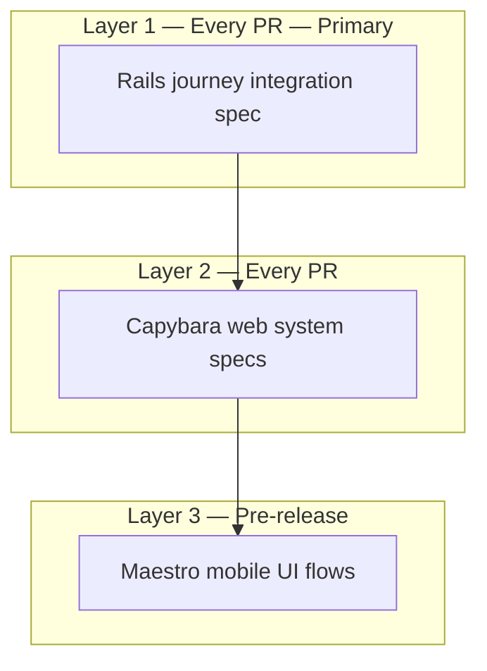

# MVP Integration Testing Strategy

**Location:** `.cursor/plans/mvp_integration_testing.plan.md`

**Last audited:** main branch — no journey spec or Maestro flows exist yet.

**Referenced by:** Phase 1–3 (journey slices), [Phase 5 — Beta Launch](mvp_phase_5_beta_launch.plan.md)

---

## 1. Recommendation: three layers, one primary

Do **not** try to drive web Capybara and mobile Detox in a single test file. The stacks are too different. Instead, use a **layered pyramid** where Layer 1 gives 80% of cross-surface confidence in CI on every PR.



| Layer | What it tests | Tool | CI frequency | Speed |
|-------|---------------|------|--------------|-------|
| **1 — Journey spec** | Full data path: web signup → onboarding → programme → mobile JWT APIs → chat | RSpec request/integration | Every PR | ~5–15 s |
| **2 — Web system** | HTML forms, redirects, button clicks on web onboarding | Capybara (+ Cuprite) | Every PR | ~10–30 s |
| **3 — Mobile UI** | RN navigation, SecureStore, SSE rendering on device/simulator | Maestro | Nightly / pre-release | ~2–5 min |

**Layer 1 is the best primary investment.** Mobile is an API client; if the Rails journey spec proves the same HTTP contract the app uses, you have cross-surface integration without mobile-native test infrastructure in CI.

---

## 2. Layer 1: Rails journey integration spec (build this first)

### Location

```
ForgeAI/spec/integration/mobile_companion_journey_spec.rb
ForgeAI/spec/support/journey_helpers.rb
```

Use `type: :request` or a dedicated `spec/integration/` folder (not `type: :system` — no browser needed).

### Pattern to extend

Existing [`package_first_flow_spec.rb`](ForgeAI/spec/requests/api/v1/package_first_flow_spec.rb) already tests trial → `/me` → team → coach preferences via JWT. Extend this into a **single linear example** that covers the full MVP journey once Phase 1–3 are built.

### Example flow (one `it` block, sequential HTTP calls)

```ruby
# Pseudocode — not implementation
it "completes the mobile companion journey" do
  # ── Web: signup ──
  post user_registration_path, params: { user: { ... } }
  user = User.last

  # ── Web: profile + intake (Phase 1 endpoints) ──
  sign_in user
  post user_profile_path, params: { ... }
  post onboarding_intake_path, params: { intake_data: { ... } }

  # ── Web: trial (Phase 2) ──
  post start_trial_path, params: { package_key: "body_recomposition" }

  # ── Async: programme generation ──
  perform_enqueued_jobs
  expect(user.workout_programmes.active).to exist

  # ── Mobile: JWT auth ──
  headers = auth_headers_for(user)   # existing ApiHelpers

  # ── Mobile: team + programmes ──
  get "/api/v1/team", headers: headers
  get "/api/v1/programmes", headers: headers
  programme_id = json_response["programmes"].first["id"]

  get "/api/v1/programmes/#{programme_id}", headers: headers
  expect(json_response["programme"]["days"]).not_to be_empty

  # ── Mobile: chat (Phase 3 SSE endpoint) ──
  post "/api/v1/chat/forge",
       params: { message: "Increase my squat weight" }.to_json,
       headers: headers
  expect(response.content_type).to include("text/event-stream")
  events = parse_sse(response.body)
  expect(events).to include(hash_including("event" => "coach_message_delta"))
end
```

### Key helpers (`journey_helpers.rb`)

| Helper | Purpose |
|--------|---------|
| `auth_headers_for(user)` | Already in [`api_helpers.rb`](ForgeAI/spec/support/api_helpers.rb) |
| `complete_web_onboarding(user)` | Encapsulates profile + intake + trial POSTs |
| `parse_sse(body)` | Split SSE stream into `{ event, data }` hashes |
| `stub_openai_chat(content:)` | Deterministic chat response (extend [`coach_chat_stubs.rb`](ForgeAI/spec/support/coach_chat_stubs.rb)) |
| `stub_openai_stream(deltas:)` | Token deltas for SSE chat tests |

### External service stubs (required for CI determinism)

| Service | Stub strategy |
|---------|---------------|
| OpenAI / LLM | WebMock or `allow(CoachChatService).to receive(...)` — never hit real API in CI |
| Stripe | Use existing checkout specs pattern; journey spec uses `start_package_trial!` path, not Stripe |
| ForgeAIService | Not called if Phase 3 Rails SSE chat ships |
| Solid Queue jobs | `ActiveJob::Base.queue_adapter = :test` + `perform_enqueued_jobs` |

### Why this works for "web + mobile"

Both surfaces share **one Rails backend and one PostgreSQL database**. The journey spec exercises:
- Web controllers (signup, onboarding forms)
- Background jobs (programme generation)
- Mobile API v1 endpoints (JWT auth, team, programmes, chat)

Mobile UI code (`stream.ts`, navigation, SecureStore) is thin HTTP + SSE parsing — covered separately by unit tests ([`stream.spec.ts`](ForgeAI-Mobile/src/chat/stream.spec.ts), [`reducer.spec.ts`](ForgeAI-Mobile/src/chat/reducer.spec.ts)) and optionally Maestro.

---

## 3. Layer 2: Web system specs (Capybara)

### Current state

- Capybara installed; system specs use **`rack_test` driver** ([`rails_helper.rb`](ForgeAI/spec/rails_helper.rb)) — no JavaScript, no real browser
- [`user_registration_spec.rb`](ForgeAI/spec/system/user_registration_spec.rb) already tests signup → onboarding redirect
- Separate CI job `system-test` runs `spec/system`

### When Phase 1 onboarding forms ship

Add `spec/system/onboarding_spec.rb`:
- Sign up → fill profile form → fill intake → start trial → see programme on dashboard
- Uses `rack_test` if forms are plain HTML POST (no Stimulus/Turbo complexity)
- Upgrade to **Cuprite** (headless Chrome via CDP) only if onboarding uses Turbo frames or client-side validation

```ruby
# Gemfile (only if needed)
gem "cuprite"

# rails_helper.rb
driven_by :cuprite, screen_size: [1400, 1400], options: { headless: true }
```

Keep system specs **web-only**. Do not attempt to test mobile here.

---

## 4. Layer 3: Mobile UI E2E (Maestro — pre-release)

### Why Maestro over Detox

| | Maestro | Detox |
|---|---------|-------|
| Expo compatibility | Excellent — YAML flows, works with Expo Go | Requires native build / dev client |
| Setup complexity | Low | High |
| CI | Needs simulator + running Metro + Rails | Same, plus native compilation |
| Best for | Smoke flows before beta | Deep RN interaction testing |

### Location

```
ForgeAI-Mobile/.maestro/
  config.yaml
  flows/
    sign_in.yaml
    view_programme.yaml
    chat_with_forge.yaml
```

Or at monorepo root: `e2e/maestro/` if flows need to document the full cross-app setup.

### Prerequisites (local or CI)

1. `docker compose up` — Rails on `:3000`, Postgres
2. Seed or pre-create test user via journey spec rake task
3. Metro bundler running (`npx expo start`)
4. iOS Simulator or Android emulator
5. `maestro test .maestro/flows/`

### Example Maestro flow (sign-in → home)

```yaml
appId: host.exp.exponent  # Expo Go
---
- launchApp
- tapOn: "Email"
- inputText: "journey-test@example.com"
- tapOn: "Password"
- inputText: "password123"
- tapOn: "Sign in"
- assertVisible: "Your Forge Team"
```

### CI placement

**Do not add Maestro to every PR** — macOS runners, simulators, and Metro are slow and flaky. Run:
- Nightly workflow (`schedule:`)
- Manual `workflow_dispatch` before beta releases
- Locally before TestFlight builds

---

## 5. Monorepo E2E workflow (optional, Phase 5)

Add at repo root:

```
.github/workflows/e2e-journey.yml
docker-compose.test.yml   # Rails + Postgres only (no mobile Metro)
```

```yaml
# Pseudocode workflow
jobs:
  journey:
    runs-on: ubuntu-latest
    services:
      postgres: ...
    steps:
      - checkout (with submodules)
      - setup Ruby in ForgeAI/
      - run: bundle exec rspec spec/integration/
```

Mobile CI ([`ForgeAI-Mobile/.github/workflows/ci.yml`](ForgeAI-Mobile/.github/workflows/ci.yml)) stays separate — unit tests only. Cross-surface confidence comes from the Rails journey spec.

---

## 6. Test data strategy

| Do | Don't |
|----|-------|
| Use FactoryBot factories ([`factories/users.rb`](ForgeAI/spec/factories/users.rb), [`onboarding_intakes.rb`](ForgeAI/spec/factories/onboarding_intakes.rb)) | Rely on `db:seed` in integration tests |
| Generate unique emails per example (`"journey-#{SecureRandom.hex(4)}@example.com"`) | Share state between examples |
| Wrap in transactional fixtures (default RSpec behavior) | Hit production/staging APIs |
| Stub OpenAI/Stripe | Require real API keys in CI |

Optional: add a rake task `test:prepare_journey_user` that creates a known account for manual QA and Maestro (`journey-test@example.com`).

---

## 7. What each layer catches

| Failure | Layer 1 | Layer 2 | Layer 3 |
|---------|---------|---------|---------|
| Onboarding form missing field | ✓ (POST fails) | ✓ (UI) | |
| Trial not started after intake | ✓ | ✓ | |
| Programme job not enqueued | ✓ | ✓ | |
| Mobile `/team` 404 after trial | ✓ | | |
| JWT auth broken | ✓ | | |
| SSE chat wrong event format | ✓ | | ✓ |
| RN navigation broken | | | ✓ |
| SecureStore token not sent | | | ✓ |
| Wrong tab selected after sign-in | | | ✓ |

---

## 8. Per-phase delivery (journey spec grows each phase)

The journey spec is **one file, three slices** — each phase enables the next slice. Todos live in the phase plans.

| Phase | Plan | Journey slice | What ships in CI |
|-------|------|---------------|------------------|
| **1** | [mvp_phase_1_web_onboarding.plan.md](mvp_phase_1_web_onboarding.plan.md) | Slice 1 | `journey_helpers.rb` + signup → profile → intake — **not started on main** |
| **2** | [mvp_phase_2_web_trial_launch.plan.md](mvp_phase_2_web_trial_launch.plan.md) | Slice 2 | + trial → `perform_enqueued_jobs` → `/team` + `/programmes` |
| **3** | [mvp_phase_3_rails_sse_chat.plan.md](mvp_phase_3_rails_sse_chat.plan.md) | Slice 3 | + `POST /api/v1/chat/forge` SSE — **full journey green** |
| **4** | [mvp_phase_4_mobile_companion.plan.md](mvp_phase_4_mobile_companion.plan.md) | — | Maestro flows test **package-first** mobile UI (team home, not coach list) |
| **5** | [mvp_phase_5_beta_launch.plan.md](mvp_phase_5_beta_launch.plan.md) | — | Maestro flows + `e2e-journey.yml` workflow |

**File:** `ForgeAI/spec/integration/mobile_companion_journey_spec.rb`

Use `pending` or `context ..., pending: "Phase N"` for slices not yet implemented so CI stays green during incremental delivery.

**Also per phase:**
- Phase 1: Capybara `spec/system/onboarding_spec.rb` (web UI)
- Phase 2: extend system spec through trial → programme on dashboard
- Phase 5: Maestro flows + nightly workflow

---

## 9. Success criteria

- [ ] Single RSpec example runs full web → mobile API journey in CI without external API keys
- [ ] Journey spec fails if any phase regresses (onboarding, trial, programme, chat)
- [ ] Web system spec covers onboarding form UX
- [ ] Maestro smoke flow documented for pre-release manual/CI run
- [ ] Phase 5 manual smoke test script matches automated journey spec steps
