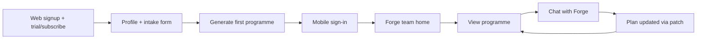
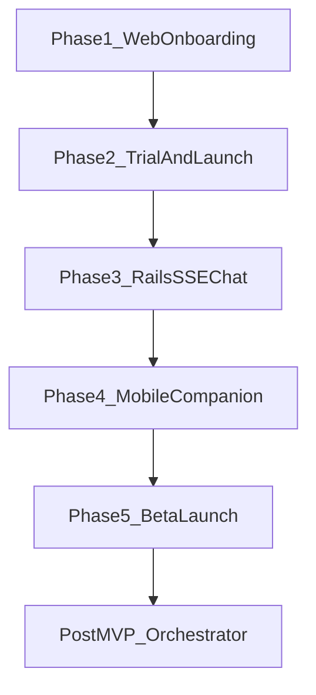

# MVP Overview — Mobile Companion Launch

**Location:** `.cursor/plans/mvp_overview.plan.md`

**Last audited:** main branch (post-pull)

---

## MVP Definition

**Target:** Users sign up and subscribe on **web**, complete onboarding there, then use **mobile** as their daily companion: Forge team home, programme viewer, and streaming chat with Forge.

**Single package scope:** Body Recomposition only (`:active`). Other packages stay "Coming Soon."

**Core loop:**

---

## Phase Plans

| Phase | Plan file | App(s) | Delivers |
|-------|-----------|--------|----------|
| **1** | [mvp_phase_1_web_onboarding.plan.md](mvp_phase_1_web_onboarding.plan.md) | ForgeAI | Profile + intake forms; onboarding no longer a dead end |
| **2** | [mvp_phase_2_web_trial_launch.plan.md](mvp_phase_2_web_trial_launch.plan.md) | ForgeAI | Package trial, programme generation trigger, prelaunch off, Stripe verified |
| **3** | [mvp_phase_3_rails_sse_chat.plan.md](mvp_phase_3_rails_sse_chat.plan.md) | ForgeAI + ForgeAI-Mobile | Rails SSE chat API; mobile chat wired to Rails |
| **4** | [mvp_phase_4_mobile_companion.plan.md](mvp_phase_4_mobile_companion.plan.md) | ForgeAI-Mobile | Package-first mobile UI, web-setup redirect, env config, programme refresh |
| **5** | [mvp_phase_5_beta_launch.plan.md](mvp_phase_5_beta_launch.plan.md) | All | E2E smoke test, launch checklist, private beta |
| **Testing** | [mvp_integration_testing.plan.md](mvp_integration_testing.plan.md) | ForgeAI (+ Maestro) | Cross-surface journey spec, web system tests, mobile UI smoke |
| **Post-MVP** | [mvp_post_mvp_orchestrator.plan.md](mvp_post_mvp_orchestrator.plan.md) | ForgeAIService | Multi-agent orchestrator repair |

---

## Current State on Main (Summary)

| Codebase | Readiness | Done on main | Still blocking MVP |
|----------|-----------|--------------|-------------------|
| **ForgeAI** | ~75% | Package-first models/API, Stripe checkout, prelaunch infra, web chat, exercise catalog admin, improved onboarding signpost + dashboard CTA | **No profile/intake forms**, no web trial button, no auto programme trigger, prelaunch still ON |
| **ForgeAI-Mobile** | ~40% | Auth, programmes (read), chat UI + SSE client, coach list home | **Still coach-centric** (not package-first team home), chat points at broken orchestrator, no `/team` API client, types lag behind Rails `/me` |
| **ForgeAIService** | ~35% | CI workflow, config/README, orchestrator scaffold | **Cannot boot** — 4 core modules missing; not required if Rails SSE chat ships |

**Cross-repo mismatch:** Rails is package-first (`UserSerializer` exposes `active_package` + `forge_team`); mobile still uses coach-centric home (`getCoaches`, `CoachCard`, `coach/[id].tsx`). Phase 4 must migrate mobile before companion launch.

Rails operates independently via `FallbackProgrammeGenerator` and `CoachChatService`. Web MVP does **not** require ForgeAIService.

---

## Already Complete (not in phase scope)

- [Exercise catalog admin + API enrichment](exercise_catalog.plan.md) — all phases done
- Package-first domain model (`Package`, `PackageTrial`, `CoachIdentity`, `OnboardingIntake` model)
- Mobile read API (`/me`, `/team`, `/programmes`, `/coach_preferences`, `/packages`)
- [`spec/requests/api/v1/package_first_flow_spec.rb`](ForgeAI/spec/requests/api/v1/package_first_flow_spec.rb) — programmatic trial/team flow
- [`docs/STRIPE_MIGRATION.md`](ForgeAI/docs/STRIPE_MIGRATION.md)

---

## MVP Success Criteria

- [ ] New user signs up on web, completes intake, starts trial, sees a generated programme in one session
- [ ] Same user signs into mobile and sees Forge team + programme
- [ ] User chats with Forge on mobile; a plan patch updates the programme
- [ ] Stripe subscription works for Body Recomposition (trial → paid)
- [ ] Prelaunch mode disabled; registration open
- [ ] No dependency on ForgeAIService for the core demo path

---

## Explicitly Out of Scope

- Mobile sign-up, billing, or in-app package selection
- Chat with Nova/Kael/Fuel/Sage/Pulse from mobile home (Forge only for MVP)
- Exercise logging on mobile
- Meal plan generation
- Additional packages beyond Body Recomposition
- Exercise catalog image backfill (ops, not engineering)
- Full multi-agent orchestrator (post-MVP)
- `POST /api/v1/packages/:key/activate` (companion model — trial starts on web)

---

## Bottom Line

**Main branch progress:** Backend foundation is substantially ahead of the UI layers. The critical path is unchanged: Phase 1 → 2 unblock web users, Phase 3 → 4 align mobile with package-first Rails, Phase 5 validates the loop.

**New finding:** Mobile on main lags Rails — Phase 4 now explicitly includes migrating from coach-centric to package-first team home, not just polish.
