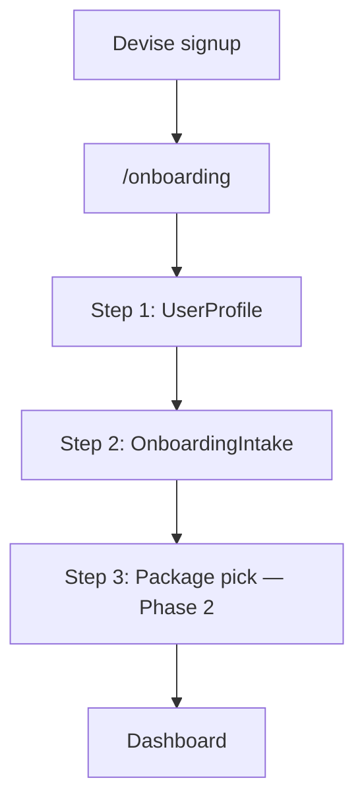

# MVP Phase 1: Web Onboarding Forms

**Location:** `.cursor/plans/mvp_phase_1_web_onboarding.plan.md`

**Depends on:** Nothing (first phase)

**Blocks:** [Phase 2](mvp_phase_2_web_trial_launch.plan.md) (trial + programme trigger needs intake completion)

**App:** ForgeAI only

---

## 0. Already on main (do not rebuild)

| Item | Status |
|------|--------|
| `UserProfile`, `OnboardingIntake` models + `BASELINE_QUESTIONS` | Done |
| Migrations, factories, model specs | Done |
| Onboarding signpost page (`/onboarding`) with improved UX | Done |
| [`spec/requests/onboardings_spec.rb`](ForgeAI/spec/requests/onboardings_spec.rb) — signpost + redirect logic | Done |
| Post-signup/sign-in redirect to `/onboarding` when incomplete | Done |
| Dashboard "Get started" CTA when `needs_onboarding?` (no active package) | Done |
| `User#onboarding_completed?(package_key)` on model | Done — **not wired to UI or gating yet** |

---

## 1. Problem

[`OnboardingsController`](ForgeAI/app/controllers/onboardings_controller.rb) renders a signpost page only. Routes comment in [`config/routes.rb`](ForgeAI/config/routes.rb) confirms "no form yet."

[`User#onboarding_complete?`](ForgeAI/app/models/user.rb) requires `profile_completed? && active_package.present?`, but there is no UI or controller to create [`UserProfile`](ForgeAI/app/models/user_profile.rb) or submit [`OnboardingIntake`](ForgeAI/app/models/onboarding_intake.rb).

**Impact:** New signups cannot progress. `GenerateWorkoutProgrammeJob` requires a completed profile.

---

## 2. Goals and non-goals

### Goals
- Web multi-step onboarding: profile basics → intake questionnaire
- Reuse existing `OnboardingIntake::BASELINE_QUESTIONS` — do not invent new schema
- Mark intake `completed: true` on submit; sync relevant fields to `UserProfile` where overlapping
- Redirect incomplete users to onboarding — extend beyond current narrow `ensure_profile_completed!` (today only on `WorkoutProgrammesController`, checks profile only not package/intake)
- Wire step routing in `OnboardingsController` — redirect users with profile but no intake to intake step; users with intake but no package to pricing/trial (Phase 2)

### Non-goals (deferred to Phase 2)
- Package trial activation
- Programme generation trigger
- Stripe checkout integration in onboarding flow
- Mobile API endpoints for profile/intake

---

## 3. Proposed flow



For Phase 1, stop after intake submit and redirect to a "pick your package" placeholder or existing pricing link. Phase 2 wires trial/Stripe into step 3.

---

## 4. Implementation

### Controllers

**`UserProfilesController`** (web, authenticated)
- `new` / `create` — first-time profile setup
- `edit` / `update` — profile edits from settings (optional in Phase 1)
- Strong params aligned with [`UserProfile`](ForgeAI/app/models/user_profile.rb) validations

**`OnboardingIntakesController`** (web, authenticated)
- `new` / `create` — render questions from `OnboardingIntake::BASELINE_QUESTIONS`
- Scope to `body_recomposition` package key for MVP
- Store answers in `intake_data` JSONB; set `completed: true`

### Routes

Extend existing onboarding resource or add nested resources:

```ruby
resource :onboarding, only: [:show], controller: "onboardings"
resource :user_profile, only: %i[new create edit update]
resources :onboarding_intakes, only: %i[new create]
```

### Views

Replace [`onboardings/show.html.erb`](ForgeAI/app/views/onboardings/show.html.erb) signpost with a step indicator. Follow existing Tailwind patterns from dashboard/pricing views.

### Redirects

- Expand [`ensure_profile_completed!`](ForgeAI/app/controllers/application_controller.rb) — apply to dashboard and other gated routes; consider checking intake completion via `onboarding_completed?(package_key)` not just `profile_completed?`
- [`OnboardingsController#show`](ForgeAI/app/controllers/onboardings_controller.rb) — redirect to dashboard if `onboarding_complete?` (already present); add step routing for profile vs intake vs package
- Update routes comment in [`config/routes.rb`](ForgeAI/config/routes.rb) once forms ship (still says "no form yet")

---

## 5. Testing

### Unit / request specs

| Spec | Coverage |
|------|----------|
| `spec/requests/user_profiles_spec.rb` | Create, update, validation errors, auth required |
| `spec/requests/onboarding_intakes_spec.rb` | Submit intake, idempotency (one per user+package), completed flag |
| Extend `spec/requests/onboardings_spec.rb` | Step routing, form submission redirects (existing spec covers signpost only) |

### Journey integration spec — Slice 1

Ship the foundation for the cross-surface journey test ([mvp_integration_testing.plan.md](mvp_integration_testing.plan.md)):

**New files:**
- `spec/support/journey_helpers.rb` — `register_user`, `complete_profile`, `complete_intake` helpers
- `spec/integration/mobile_companion_journey_spec.rb` — start with one example:

```ruby
it "slice 1: signup through profile and intake" do
  user = register_user_via_web
  complete_profile(user)
  complete_intake(user, package_key: "body_recomposition")
  expect(user.reload.profile_completed?).to be true
  expect(user.onboarding_intakes.completed).to exist
end
```

Mark later slices with `pending` or separate `context` blocks commented until Phases 2–3 land:

```ruby
context "slice 2: trial and programme", pending: "Phase 2" do ... end
context "slice 3: mobile API and chat", pending: "Phase 3" do ... end
```

### Web system spec

| Spec | Coverage |
|------|----------|
| `spec/system/onboarding_spec.rb` | Sign up → fill profile form → fill intake → redirected to package step (Phase 2 placeholder) |

Pattern reference: existing [`user_registration_spec.rb`](ForgeAI/spec/system/user_registration_spec.rb).

---

## 6. Success criteria

- [ ] New user after signup can complete profile form
- [ ] Same user can submit intake questionnaire with all `BASELINE_QUESTIONS`
- [ ] `user.profile_completed?` returns true after profile save
- [ ] `OnboardingIntake` record exists with `completed: true`
- [ ] Incomplete users hitting `/dashboard` or `/workout_programmes` are redirected to onboarding
- [ ] Journey spec slice 1 passes (signup → profile → intake)
- [ ] Web system spec covers onboarding form UX
- [ ] Request specs pass; RuboCop clean

---

## 7. Files (new and modified)

### New
- `app/controllers/user_profiles_controller.rb`
- `app/controllers/onboarding_intakes_controller.rb`
- `app/views/user_profiles/new.html.erb` (and/or `_form.html.erb`)
- `app/views/onboarding_intakes/new.html.erb`
- `spec/requests/user_profiles_spec.rb`
- `spec/requests/onboarding_intakes_spec.rb`
- `spec/support/journey_helpers.rb`
- `spec/integration/mobile_companion_journey_spec.rb` (slice 1)
- `spec/system/onboarding_spec.rb`

### Modified
- `config/routes.rb`
- `app/views/onboardings/show.html.erb`
- `app/controllers/onboardings_controller.rb` (step routing if needed)
