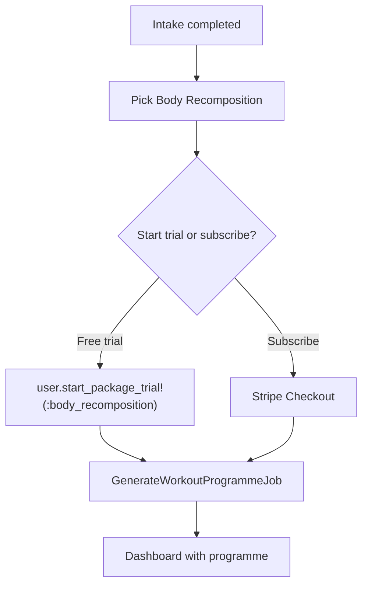

# MVP Phase 2: Trial, Programme Trigger & Launch Hygiene

**Location:** `.cursor/plans/mvp_phase_2_web_trial_launch.plan.md`

**Depends on:** [Phase 1](mvp_phase_1_web_onboarding.plan.md) (profile + intake forms)

**Blocks:** [Phase 3](mvp_phase_3_rails_sse_chat.plan.md) (mobile needs programmes to exist)

**App:** ForgeAI only

---

## 0. Already on main (do not rebuild)

| Item | Status |
|------|--------|
| `User#start_package_trial!`, `PackageTrial` model + specs | Done |
| Stripe checkout, webhooks, pricing page with package cards | Done |
| [`docs/STRIPE_MIGRATION.md`](ForgeAI/docs/STRIPE_MIGRATION.md) | Done |
| `GenerateWorkoutProgrammeJob` reads `onboarding_intake` via `AiWorkoutService` | Done — ready for auto-trigger |
| [`spec/requests/api/v1/package_first_flow_spec.rb`](ForgeAI/spec/requests/api/v1/package_first_flow_spec.rb) | Done — programmatic trial/team flow |
| Prelaunch page, signup blocking, Flipper `:prelaunch_mode` | Done — **still enabled by default** |

**Gap on main:** Pricing page copy promises "7-day free trial" but CTAs are **Subscribe only** (Stripe checkout) — no "Start free trial" button calling `start_package_trial!`.

---

## 1. Problem

Models and specs for package trials exist ([`User#start_package_trial!`](ForgeAI/app/models/concerns/user/package_access.rb)), but there is no web UI to start a trial during onboarding. Programme generation is not triggered automatically after intake.

Prelaunch mode ([Flipper `:prelaunch_mode`](ForgeAI/app/controllers/users/registrations_controller.rb)) may block new registrations.

---

## 2. Goals and non-goals

### Goals
- Step 3 of onboarding: pick Body Recomposition → start 7-day trial OR redirect to Stripe checkout
- On trial + completed intake: enqueue `GenerateWorkoutProgrammeJob` for Forge (strength role)
- Disable prelaunch mode for launch
- Verify Stripe price IDs configured for `body_recomposition`

### Non-goals
- Mobile package activation API (`POST /packages/:key/activate`) — not needed for companion model
- Additional packages beyond Body Recomposition
- Meal plan generation

---

## 3. Proposed flow



---

## 4. Implementation

### Package trial step

Add to onboarding flow (controller action or dedicated step):
- Display Body Recomposition package details (from [`Package`](ForgeAI/app/models/package/definitions.rb))
- **"Start 7-day free trial"** button → `current_user.start_package_trial!(:body_recomposition)` (closes gap vs pricing page copy)
- "Subscribe now" link → existing [`SubscriptionsController`](ForgeAI/app/controllers/subscriptions_controller.rb) checkout flow
- Optionally add trial CTA on pricing page alongside Subscribe for active package

### Programme generation trigger

After `onboarding_complete?` becomes true (profile + active package) **and** intake is completed (`onboarding_completed?(:body_recomposition)`):
- Enqueue `GenerateWorkoutProgrammeJob.perform_later(user.id, agent_type: "forge")`
- Job already consumes intake data when present — no job changes needed
- Show loading/generating state on dashboard if programme not yet ready

### Launch hygiene

- Flipper: disable `:prelaunch_mode` in production (and development for testing)
- Verify `.env` has Stripe keys and price IDs for `body_recomposition`
- Update stale references in [`README.md`](ForgeAI/README.md) and [`AGENTS.md`](ForgeAI/AGENTS.md) (package-first model, current coach names)

---

## 5. Testing

### Unit / request specs

| Spec | Coverage |
|------|----------|
| Extend onboarding request specs | Trial start during onboarding flow |
| `spec/jobs/generate_workout_programme_job_spec.rb` | Job enqueued after onboarding complete |
| Existing `spec/requests/subscriptions_spec.rb` | Checkout still works (may need Stripe env) |
| Existing `spec/requests/api/v1/package_first_flow_spec.rb` | Reference flow patterns |

### Journey integration spec — Slice 2

Extend [`mobile_companion_journey_spec.rb`](ForgeAI/spec/integration/mobile_companion_journey_spec.rb) (created in Phase 1):

```ruby
it "slice 2: trial, programme generation, and mobile programme APIs" do
  user = register_user_via_web
  complete_profile(user)
  complete_intake(user, package_key: "body_recomposition")
  start_trial(user, package_key: "body_recomposition")

  perform_enqueued_jobs
  expect(user.workout_programmes.active).to exist

  headers = auth_headers_for(user)
  get "/api/v1/team", headers: headers
  expect(response).to have_http_status(:ok)

  get "/api/v1/programmes", headers: headers
  expect(json_response["programmes"]).not_to be_empty
end
```

**Requirements:**
- Stub AI service in journey spec (`WebMock` → `Errno::ECONNREFUSED` on `/generate-programme`, same as job spec)
- Add `start_trial(user)` to `journey_helpers.rb`
- Remove `pending: "Phase 2"` from slice 2 context
- Leave slice 3 (chat) pending until Phase 3

### Web system spec

Extend `spec/system/onboarding_spec.rb` (Phase 1) through trial step → dashboard shows programme.

---

## 6. Success criteria

- [ ] User completing intake can start a 7-day Body Recomposition trial from web
- [ ] User can alternatively subscribe via Stripe checkout
- [ ] First programme is generated automatically after onboarding completes
- [ ] Dashboard shows the generated programme (not empty state)
- [ ] Prelaunch mode disabled; new users can register
- [ ] Journey spec slice 2 passes (trial → programme → mobile JWT APIs)
- [ ] Manual smoke test passes: signup → profile → intake → trial → programme visible

---

## 7. Files (new and modified)

### Modified
- `app/controllers/onboardings_controller.rb` (or new step controller)
- `app/views/onboardings/` (package selection step)
- `app/controllers/dashboard_controller.rb` (generating state if needed)
- `config/routes.rb`
- `ForgeAI/README.md`, `ForgeAI/AGENTS.md`
- `spec/support/journey_helpers.rb` (add `start_trial`)
- `spec/integration/mobile_companion_journey_spec.rb` (enable slice 2)
- `spec/system/onboarding_spec.rb` (extend through trial)

### Possibly new
- `spec/requests/onboarding_trial_spec.rb`
