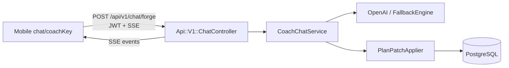

# MVP Phase 3: Rails SSE Chat API

**Location:** `.cursor/plans/mvp_phase_3_rails_sse_chat.plan.md`

**Depends on:** [Phase 2](mvp_phase_2_web_trial_launch.plan.md) (users need programmes for chat context)

**Blocks:** [Phase 4](mvp_phase_4_mobile_companion.plan.md) (polish assumes chat works)

**Apps:** ForgeAI + ForgeAI-Mobile (minimal — stream.ts only; package-first migration is Phase 4)

---

## 0. Already on main (do not rebuild)

| Item | Status |
|------|--------|
| Web chat via `CoachChatsController` + `CoachChatService` | Done |
| `CoachAccessPolicy`, plan patches, fallback engine | Done |
| Mobile chat UI, SSE client, SQLite history, retry UX | Done |
| [`spec/support/coach_chat_stubs.rb`](ForgeAI/spec/support/coach_chat_stubs.rb) | Done — HTTP stubs for external AI service (extend for SSE) |
| Mobile REST API client (auth, `/me`, `/programmes`) | Done |

**Gap on main:** Mobile [`stream.ts`](ForgeAI-Mobile/src/chat/stream.ts) POSTs to Python orchestrator (`localhost:8000`). No Rails SSE endpoint. Mobile home is still coach-centric (`coach/[id].tsx`) — Forge chat reachable via coach cards once stream.ts is repointed.

---

## 1. Problem

Mobile [`stream.ts`](ForgeAI-Mobile/src/chat/stream.ts) calls `POST /chat` on ForgeAIService. That service **cannot boot** — missing core modules. Patch schema also conflicts with Rails `PlanPatchApplier`.

Rails web chat via [`CoachChatService`](ForgeAI/app/services/coach_chat_service.rb) already works (OpenAI → fallback engine, plan patches via domain ops).

---

## 2. Goals and non-goals

### Goals
- `POST /api/v1/chat/:coach_key` — JWT-authenticated SSE endpoint
- SSE event types matching mobile expectations: `status`, `coach_message_delta`, `patch_applied`, `error`, `done`
- Wrap existing `CoachChatService` (Forge-only for MVP)
- Point mobile `stream.ts` at Rails API URL (keep existing `chat/[coachKey].tsx` route)

### Non-goals (deferred to Phase 4)
- Package-first team home migration
- Web-setup redirect when no `active_package`
- Fix ForgeAIService (post-MVP)
- Chat history sync to Rails (mobile keeps local SQLite)
- Mobile sign-up

---

## 3. SSE contract

Align with mobile [`stream.ts`](ForgeAI-Mobile/src/chat/stream.ts) `parseEventType`:

| Event | Payload fields |
|-------|----------------|
| `status` | `message` or `text`, optional `roles`/`identities` |
| `coach_message_delta` | `delta`, `coach_name`/`identity_key` |
| `patch_applied` | `summary`, `coach_name`/`agent` |
| `error` | `message`, optional `code` |
| `done` | optional `run_id` |

Request body (from mobile):
- `message` (required)
- `conversation_id` (optional — server generates if absent)
- `package` (optional — default from user's active package)

---

## 4. Architecture



---

## 5. Implementation

### Rails

**`Api::V1::ChatController`**
- `create` action — authenticate via JWT (`Api::V1::BaseController`)
- Authorize with [`CoachAccessPolicy`](ForgeAI/app/policies/coach_access_policy.rb)
- Stream response using `response.stream` or ActionController::Live
- Map `CoachChatService` output to SSE events

**Routes** — add to `namespace :api/v1`:

```ruby
post "chat/:coach_key", to: "chat#create"
```

**Streaming approach:** Chunk full `CoachChatService` response as single delta + done for MVP (upgrade to token streaming later).

### Mobile (Phase 3 scope — minimal)

**[`stream.ts`](ForgeAI-Mobile/src/chat/stream.ts)**
- Change URL from orchestrator to `${BASE_URL}/chat/${coachKey}` (reuse existing JWT in `Authorization`)
- Verify SSE parsing still works with Rails event format

**Out of Phase 3 scope:** Package-first home, web-setup redirect, onboarding screens — see [Phase 4](mvp_phase_4_mobile_companion.plan.md).

---

## 6. Testing

### Request specs

| Spec | Coverage |
|------|----------|
| `spec/requests/api/v1/chat_spec.rb` | JWT required, SSE content-type, Forge access policy, invalid coach rejected |
| `ForgeAI-Mobile/src/chat/stream.spec.ts` | Add/update if event parsing changes |

### Journey integration spec — Slice 3 (complete journey)

Extend [`mobile_companion_journey_spec.rb`](ForgeAI/spec/integration/mobile_companion_journey_spec.rb):

```ruby
it "slice 3: complete mobile companion journey including chat" do
  user = setup_onboarded_user_with_programme
  headers = auth_headers_for(user)

  post "/api/v1/chat/forge",
       params: { message: "Increase my squat weight" }.to_json,
       headers: headers

  expect(response.content_type).to include("text/event-stream")
  events = parse_sse(response.body)
  expect(events.map { |e| e[:event] }).to include("coach_message_delta", "done")
end
```

---

## 7. Success criteria

- [ ] `POST /api/v1/chat/forge` returns SSE stream with valid JWT
- [ ] Mobile chat screen connects to Rails (not orchestrator)
- [ ] User receives Forge response in chat UI (via existing `chat/[coachKey].tsx`)
- [ ] Plan patch events emitted when service modifies programme
- [ ] Journey spec slice 3 passes — **full web→mobile API journey green in CI**
- [ ] Request specs pass

---

## 8. Files (new and modified)

### New (ForgeAI)
- `app/controllers/api/v1/chat_controller.rb`
- `spec/requests/api/v1/chat_spec.rb`

### Modified (ForgeAI)
- `config/routes.rb`
- `spec/support/journey_helpers.rb` (add `parse_sse`, `setup_onboarded_user_with_programme`, chat stub)
- `spec/support/coach_chat_stubs.rb` (SSE stub helpers)
- `spec/integration/mobile_companion_journey_spec.rb` (enable slice 3)

### Modified (ForgeAI-Mobile)
- `src/chat/stream.ts`
