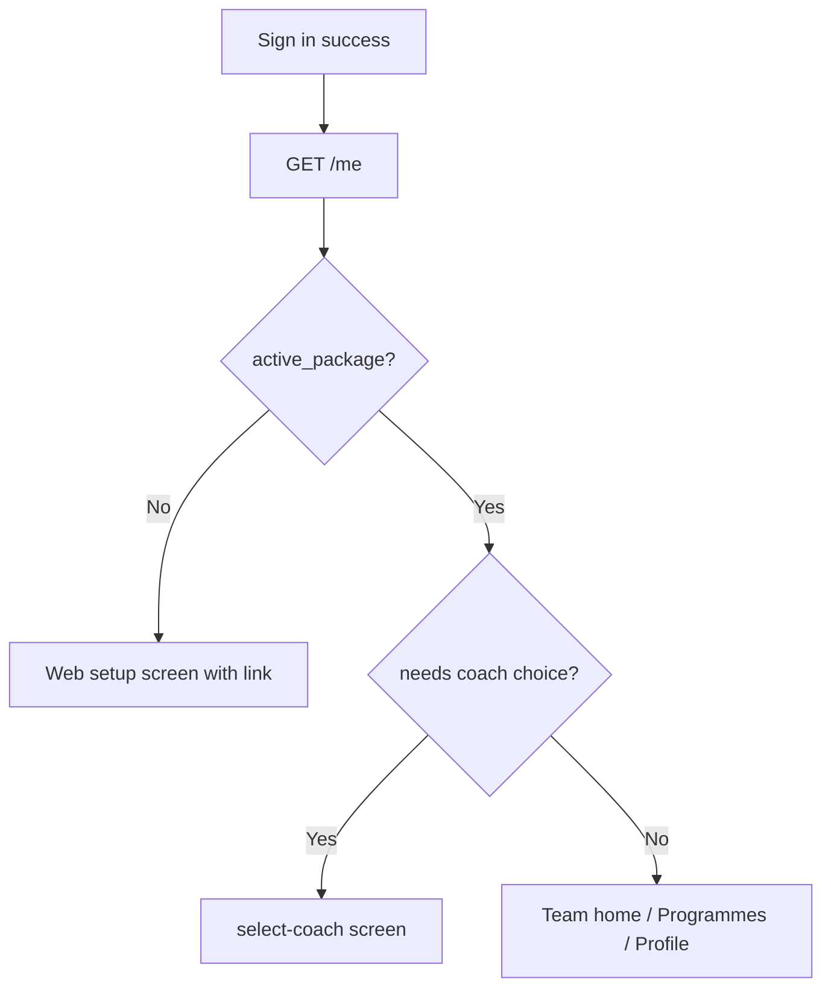

# MVP Phase 4: Mobile Package-First + Companion UX

**Location:** `.cursor/plans/mvp_phase_4_mobile_companion.plan.md`

**Depends on:** [Phase 3](mvp_phase_3_rails_sse_chat.plan.md) (chat must work via Rails)

**Blocks:** [Phase 5](mvp_phase_5_beta_launch.plan.md) (beta launch assumes polished UX)

**App:** ForgeAI-Mobile

---

## 0. Already on main (do not rebuild)

| Item | Status |
|------|--------|
| JWT auth, sign-in/out, SecureStore | Done |
| Programme list + detail (read from `/programmes`) | Done |
| Chat UI + SSE client + local SQLite + retry | Done |
| `profile_completed` on User type | Done |
| Chat `onPlanUpdated` callback (toast only) | Done — partial |

**Gap on main — mobile lags Rails:**

| Rails (main) | Mobile (main) |
|--------------|---------------|
| `UserSerializer` returns `active_package`, `forge_team`, `coach_preferences` | Types still use `subscribed_coach_keys`; no team types |
| `/api/v1/team` endpoint | No `getTeam()` in `api.ts` |
| Package-first dashboard | Home tab is coach list via `getCoaches()` + `CoachCard` |
| — | `coach/[id].tsx` still present (legacy coach hub) |
| — | No web-setup screen; auth guard goes straight to tabs |
| — | `programmeData.tsx` does not exist |
| — | Hardcoded Cloudflare tunnel in `api.ts` |

---

## 1. Problem

Mobile was built for the **old coach-centric model**. Rails on main is **package-first**. The companion MVP needs team home, package-aware routing, and polish — but main mobile hasn't caught up.

Additional rough edges:
- Hardcoded tunnel URL in [`api.ts`](ForgeAI-Mobile/src/api.ts)
- Programme screens fail silently (infinite spinner on API error)
- Chat patches show toast but don't refresh programmes

---

## 2. Goals and non-goals

### Goals
- **Package-first migration:** Replace coach list home with Forge team home (`GET /team`)
- Update [`types.ts`](ForgeAI-Mobile/src/types.ts) and [`api.ts`](ForgeAI-Mobile/src/api.ts) to match Rails `UserSerializer`
- Web-setup screen when no `active_package` (link to web onboarding — no in-app package picker)
- Optional `select-coach` flow for Nova/Kael when package has `has_choice`
- Env-based API URL (`EXPO_PUBLIC_API_URL`)
- Create + mount `ProgrammeDataProvider` for post-chat programme refresh
- User-facing error states with retry

### Non-goals
- Mobile sign-up or Stripe
- In-app package trial activation (`POST /packages/:key/activate`)
- Exercise logging UI
- Chat with all team members from home (Forge primary entry)
- Remove `getCoaches`/`getCoach` until team home replaces their usage

---

## 3. Post-login routing



---

## 4. Implementation

### Package-first migration (new — critical for main)

**Home tab** [`(tabs)/index.tsx`](ForgeAI-Mobile/app/(app)/(tabs)/index.tsx):
- Replace `getCoaches()` + `CoachCard` with `getTeam()` — show package name + team members
- Forge member is primary chat entry; link to `chat/forge`

**API + types:**
- Add `getTeam()`, `getPackages()`, `setCoachPreference()` to [`api.ts`](ForgeAI-Mobile/src/api.ts)
- Add `ForgeTeam`, `TeamMember`, `ActivePackage` to [`types.ts`](ForgeAI-Mobile/src/types.ts)
- Extend `User` with optional `active_package`, `forge_team`, `coach_preferences`

**Remove legacy:**
- Delete or redirect [`coach/[id].tsx`](ForgeAI-Mobile/app/(app)/coach/[id].tsx)
- Remove `CoachCard` component once team home ships

### Web-setup screen

- New screen when `/me` has no `active_package`
- Copy: "Complete setup at forgeai.com" with link to onboarding URL (env-configurable)
- Update [`app/_layout.tsx`](ForgeAI-Mobile/app/_layout.tsx) navigation guard

### Env config

```typescript
const DEV_API_URL = process.env.EXPO_PUBLIC_API_URL ?? "http://localhost:3000/api/v1";
```

Add `.env.example` to mobile repo.

### Programme refresh

- **Create** `src/programmeData.tsx` (does not exist on main)
- Mount in `app/(app)/_layout.tsx`
- On chat `patch_applied` in [`useChatSession`](ForgeAI-Mobile/src/chat/useChatSession.ts), trigger refresh

### Error states

Priority screens:
- [`programme/[id].tsx`](ForgeAI-Mobile/app/(app)/programme/[id].tsx)
- [`(tabs)/programmes.tsx`](ForgeAI-Mobile/app/(app)/(tabs)/programmes.tsx)
- Team home load failure

---

## 5. Testing

| Test | Coverage |
|------|----------|
| `src/api.spec.ts` (create) | `getTeam`, env URL fallback |
| Manual | Web-setup redirect for user without package |
| Manual | Chat patch → programme detail updates |

---

## 6. Success criteria

- [ ] Home shows Forge team (not coach list) for users with active package
- [ ] Users without package see web-setup screen, not empty/broken home
- [ ] Dev API URL configurable via env (no hardcoded tunnel)
- [ ] Programme detail reflects changes after chat patch
- [ ] Programme/team load failures show error + retry
- [ ] Nova/Kael preference flow works when applicable
- [ ] Mobile README matches package-first navigation

---

## 7. Files (new and modified)

### New
- `ForgeAI-Mobile/src/programmeData.tsx`
- `ForgeAI-Mobile/app/(app)/web-setup.tsx` (or equivalent)
- `ForgeAI-Mobile/app/(app)/onboarding/select-coach.tsx` (if not merged from branch)
- `ForgeAI-Mobile/src/api.spec.ts`
- `ForgeAI-Mobile/.env.example`

### Modified
- `ForgeAI-Mobile/src/api.ts`
- `ForgeAI-Mobile/src/types.ts`
- `ForgeAI-Mobile/app/(app)/(tabs)/index.tsx`
- `ForgeAI-Mobile/app/(app)/(tabs)/profile.tsx`
- `ForgeAI-Mobile/app/_layout.tsx`
- `ForgeAI-Mobile/src/chat/useChatSession.ts`
- `ForgeAI-Mobile/app/(app)/programme/[id].tsx`
- `ForgeAI-Mobile/app/(app)/(tabs)/programmes.tsx`
- `ForgeAI-Mobile/README.md`

### Removed
- `ForgeAI-Mobile/app/(app)/coach/[id].tsx`
- `ForgeAI-Mobile/src/components/CoachCard.tsx` (after team home ships)
